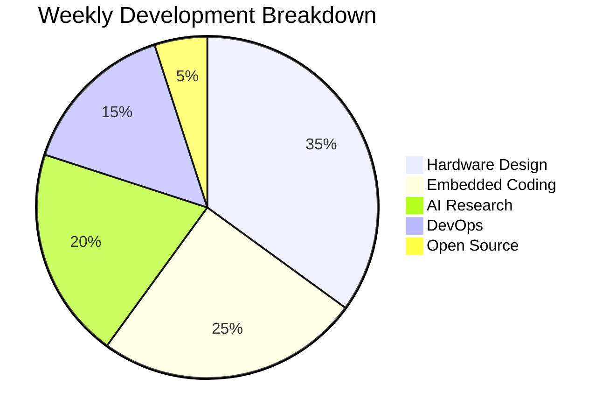

### *Hardware Developer | Embedded Systems Engineer | IoT & AI Enthusiast*

## 🔥 **My Tech Stack**

### **Hardware Development**

### **Programming Languages**

### **AI/ML**

### **Automation & DevOps**

## 🚀 **My Projects**

### **Featured Repositories**

## 🎮 **GITHUB METRICS**

  
  
  

## 📊 **Weekly Development Breakdown**

## 📊 **GitHub Analytics**

  
  

## 🏆 **GitHub Trophies**

  

  

## 🌐 **Connect With Me**

  <!-- LinkedIn -->
  
  
  <!-- Gmail -->
  
  
  <!-- Dev.to -->
  
  
  <!-- Buy Me a Coffee -->
  
  
  <!-- Profile Views -->
  

